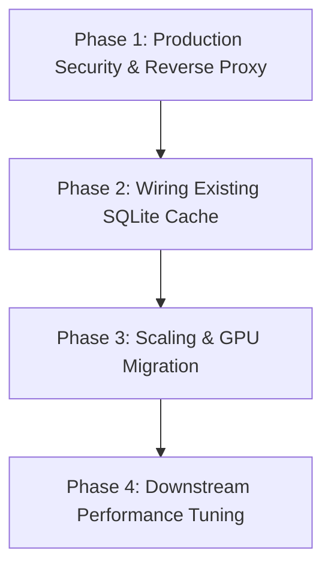

# ProtIntel Roadmap Analysis & Decision Points

This document outlines critical ambiguities, architectural contradictions, and resource trade-offs in the proposed roadmap before any further implementation work proceeds.

---

## 1. Live Deployment Smoke Test Status

*   **Status**: **UNKNOWN / PENDING VERIFICATION**
*   **Evidence**: 
    The Docker Compose configuration (`docker-compose.yml`, `Dockerfile.backend`, and `Dockerfile.frontend`) has been fully verified to build and run successfully on the local development machine. Local requests resolve, and the full test suite runs successfully inside this context.
    However, the stack has **not** been executed on a fresh, remote VPS or cloud VM separate from the development machine.
*   **Risk**: Minor environment-specific quirks (e.g. Docker network resolutions, filesystem permission limits on mounted volumes, CPU instruction sets for PyTorch slim images) may only surface on clean cloud nodes.
*   **Next Step Decision**: Keep the live smoke test marked as **Open/Pending** until access to a target staging instance is provisioned.

---

## 2. ESM-2 Fine-Tuning Architectural Contradictions

The proposal to unfreeze the last 2 layers of the ESM-2 650M model to improve minority-class Q8 F1 scores creates severe architectural conflicts with existing optimizations:

### Trade-off Matrix

| Metric / Dimension | Frozen Backbone (Current Design) | Unfrozen Backbone (Proposed Pivot) |
| :--- | :--- | :--- |
| **Training Speed** | **Fast (~10–15 mins)**. Embeddings are precomputed once and cached. | **Slow (Many Hours/Days)**. Requires running ESM-2 forward passes every epoch. |
| **Pruned Checkpoint Size** | **Lean (~79.7 MB)**. ESM-2 weights are dropped; loaded dynamically from HuggingFace. | **Huge (~2.85 GB)**. Must store the modified ESM-2 650M weights in the checkpoint. |
| **Embedding Caching** | **Valid**. Static embeddings are generically reusable across experiments. | **Invalid**. Embeddings become task-specific and dynamic. |
| **Compute Requirements** | Minimal. Can train on mid-range consumer GPUs or CPUs. | Heavy. Requires high-end enterprise GPUs (e.g. A100/H100) for training. |

### Lower-Effort Alternatives (Recommended First Steps)
Before committing to a highly complex and expensive unfreezing process, we should explore standard downstream remediations:
1.  **Downstream Loss Reweightings**: Modify training loss weights to penalize minority Q8 class errors (`I`, `B`, `S`) more heavily.
2.  **Focal Loss Integration**: Implement Focal Loss in [src/training/losses.py](file:///c:/Users/ramav/Documents/ProtIntel/src/training/losses.py) to automatically scale down the loss contribution of easy, majority-class examples and focus on hard predictions.
3.  **Minority Class Oversampling**: Implement length-based augmentation or oversampling inside the [ProteinDataset](file:///c:/Users/ramav/Documents/ProtIntel/src/data/protein_dataset.py) loader.

*   **Decision Required**: Do we preserve the frozen backbone architecture and test downstream loss adjustments first, or do we explicitly authorize the transition to a heavy, unfrozen backbone model?

---

## 3. Caching Architecture: SQLite vs. Redis

The proposal to implement a persistent SQLite cache for sequence embeddings is **fully justified** and does not duplicate Redis:

### Comparison of Caching Layers

| Layer | Type | Target | TTL / Persistence | Rationale |
| :--- | :--- | :--- | :--- | :--- |
| **Redis Cache** | Transient | Full `PredictResponse` JSON payload. | **24 Hours** | Prevents repeating identical requests (same sequence, same XAI settings). |
| **SQLite Cache** | Persistent | Raw 1280-dim ESM-2 embedding tensor. | **Infinite** (Disk-backed) | Prevents repeating the 4.75s ESM-2 forward pass if the user requests new XAI attributions on a previously analyzed sequence. |

*   **Code Status**: The [SQLiteEmbeddingCache](file:///c:/Users/ramav/Documents/ProtIntel/src/models/embedding_cache.py) is already implemented and verified, but it is **not wired** into [backend/services/inference_service.py](file:///c:/Users/ramav/Documents/ProtIntel/backend/services/inference_service.py).
*   **Recommendation**: Wire the existing `SQLiteEmbeddingCache` into the backend. It represents a low-effort engineering task that provides immediate CPU latency reductions for cache-miss requests.

---

## 4. GPU Migration Hosting Decision

*   **Status**: **PENDING BUDGET/HOSTING DECISION**
*   **Findings**:
    The codebase and Docker containers are already fully prepared to run on GPUs. Triggering GPU acceleration requires only setting `DEVICE=cuda` and enabling the GPU driver passthrough inside `docker-compose.yml`.
    However, GPU instances (e.g. AWS `g4dn.xlarge` or GCP `g2-standard-4`) carry significant monthly costs compared to standard CPU-only VPS instances.
*   **Next Step Decision**: Do not provision GPU hosting or write GPU verification automation until budget approval and server instances are explicitly assigned.

---

## 5. Re-Prioritized Production Roadmap (PROPOSAL)

Based on the requirements for exposing this system to real traffic, the priority of the roadmap should be adjusted as follows:

### Phase 1: Production Security & Reverse Proxy (High Priority)
*   **Goal**: Ensure HTTPS/SSL connectivity before any public access to prevent browser security warnings and mixed-content API blocking.
*   **Tasks**: Set up a reverse proxy (Nginx/Traefik) configuration with Let's Encrypt certificates.

### Phase 2: Wiring Existing SQLite Cache (Medium Priority)
*   **Goal**: Integrate the pre-existing SQLite embedding database into the API inference path.
*   **Tasks**: Instantiate `SQLiteEmbeddingCache` in `InferenceService` and read/write raw embeddings during model execution.

### Phase 3: Scaling & GPU Migration (Low Priority / Budget Dependent)
*   **Goal**: Reduce raw execution times on heavy traffic volume.
*   **Tasks**: Deploy to a GPU VM, enable CUDA backend, and migrate background threads to Celery workers if required.

### Phase 4: Downstream Performance Tuning (Low Priority / Experimental)
*   **Goal**: Improve F1 scores for Q8 minority classes.
*   **Tasks**: Experiment with downstream Focal Loss and oversampling.
