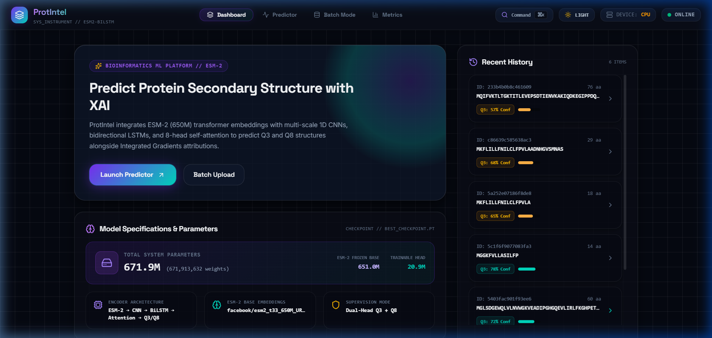
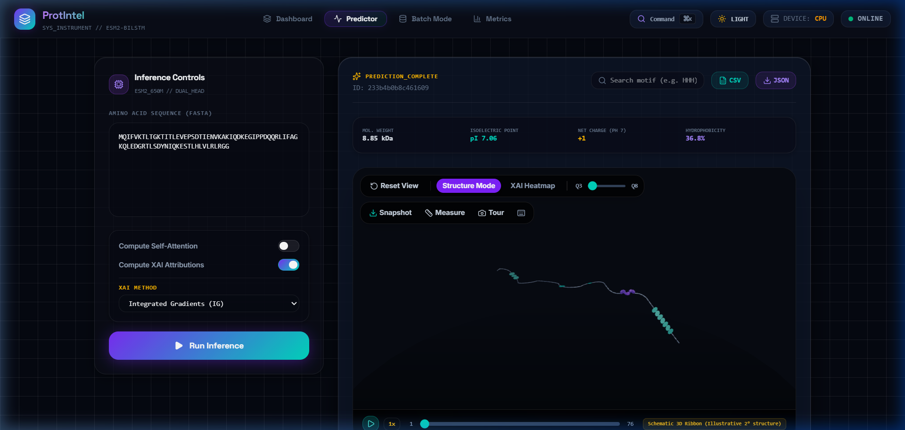
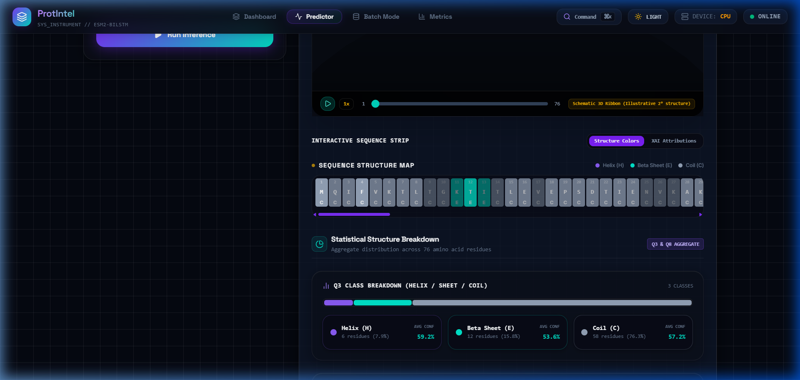
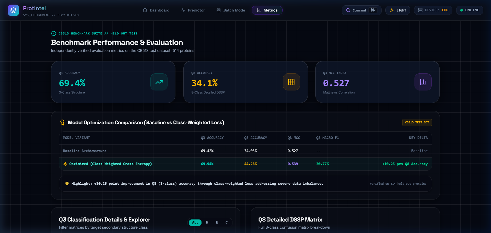
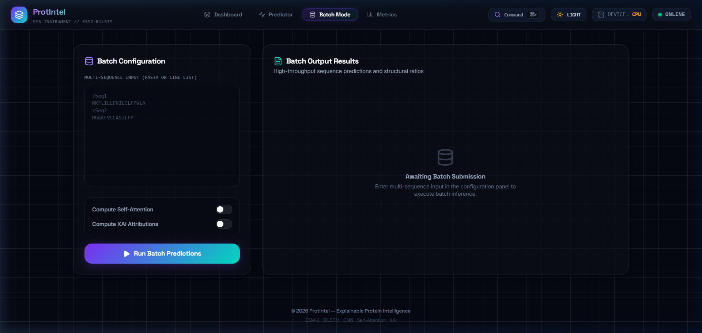

# ProtIntel 🧬

**Explainable Protein Secondary Structure Prediction using ESM-2 (650M), CNN-BiLSTM, and Multi-Head Attention**

[](https://opensource.org/licenses/MIT)
[](https://www.python.org/)
[](https://pytorch.org/)
[](https://fastapi.tiangolo.com/)
[](https://react.dev/)
[](https://threejs.org/)

---

## 🌟 Overview & User Interface

**ProtIntel** is a production-grade deep learning platform for predicting protein secondary structure (Q3 and Q8) from raw amino acid sequences with built-in Explainable AI (XAI) and real-time interactive 3D visual analytics.

### 🖥️ Platform Dashboard


### 🔬 Interactive 3D Secondary Structure Visualizer
Featuring studio 4-point scientific lighting, dynamic bounding-sphere 3/4 isometric auto-framing, distance measurement, and cinematic fly-through camera tours:


### 🌡️ Explainable AI (XAI) Attribution Heatmap
Live Integrated Gradients (IG) and SHAP feature importance colormapped directly onto the 3D ribbon backbone and 2D residue strips:


### 📊 Q3 & Q8 Statistical Breakdown Panels
Deep structural metrics including Q3 proportions, 8-state DSSP distributions, confidence histograms, physicochemical parameters, and conformational entropy:


### 📈 Benchmark Performance & Evaluation Suite
Independent verification on the CB513 test set (514 proteins) with confusion matrices, per-class F1, and MCC metrics:


### ⚡ Batch Mode High-Throughput Processing
FASTA multi-sequence batch inference with real-time structural summary readouts and CSV/JSON export:


---

## 🧠 Key Features

- **ESM-2 Embeddings**: Leverages Meta AI's 650M parameter protein language model (`esm2_t33_650M_UR50D`) for rich per-residue 1280D representations.
- **Multi-Scale Convolutional Architecture**: Captures local residue motifs across multiple receptive fields (kernel sizes 3, 5, 7) with residual connections.
- **Bidirectional LSTM**: Models long-range sequential context across the entire polypeptide chain (2 stacked BiLSTM layers, hidden size 256).
- **Multi-Head Self-Attention**: 8-head self-attention module providing interpretable attention matrices.
- **Explainable AI (XAI)**:
  - **Integrated Gradients (IG)**: Path-integral gradient attributions highlighting critical folding residues.
  - **SHAP (SHapley Additive exPlanations)**: Game-theoretic feature attributions.
  - **Attention Rollout**: Layer-wise attention flow tracking.
- **Dual-Task Joint Supervision**: Simultaneous Q3 (Helix, Sheet, Coil) and Q8 (8 DSSP states) prediction heads.
- **Interactive 3D Web Visualizer**: Hardware-accelerated Three.js ribbon renderer with Q3/Q8 color morphing, XAI heatmaps, timeline scrubbing, snapshot export, and cinematic fly-through tours.
- **Production-Ready FastAPI Backend**: High-performance REST endpoints with async background task handling, FASTA parsing, and batch prediction.

---

## 📐 Model Architecture

```
                 Input Amino Acid Sequence (FASTA)
                                ↓
                 [ESM-2 650M Transformer Base]
                 Per-residue embeddings: L × 1280
                                ↓
               [Multi-Scale 1D Convolutional Block]
                Kernels: 3, 5, 7 + Residual Skips
                                ↓
                    [Bidirectional LSTM]
                    2 Layers, Hidden = 256
                                ↓
                 [Multi-Head Self-Attention]
               8 Heads (Interpretable Weights)
                                ↓
                 ┌──────────────┴──────────────┐
                 ↓                             ↓
          [Q3 Classifier Head]          [Q8 Classifier Head]
           3-Class Prediction            8-Class Prediction
            (H, E, C States)              (DSSP Conformations)
```

### Classification Heads

#### Q3 Classification (3 Classes)
| Class | Name | Color Indicator |
|:---:|:---|:---|
| **H** | $\alpha$-Helix | `#7B2FF7` (Violet) |
| **E** | Extended Strand / $\beta$-Sheet | `#00D9C0` (Teal) |
| **C** | Random Coil / Loop | `#64748B` (Slate) |

#### Q8 Classification (8 DSSP States)
| State | Description | DSSP Code |
|:---:|:---|:---:|
| **H** | $\alpha$-Helix | Standard 4-turn helix |
| **E** | $\beta$-Sheet | Extended strand in parallel/antiparallel $\beta$-sheet |
| **G** | $3_{10}$-Helix | 3-turn helix |
| **I** | $\pi$-Helix | 5-turn helix |
| **B** | $\beta$-Bridge | Isolated $\beta$-bridge residue |
| **T** | Hydrogen bonded Turn | 3-, 4-, or 5-residue turn |
| **S** | Bend | High-curvature region |
| **C** | Coil | Unstructured loop |

---

## 💻 System Requirements

| Component | Minimum | Recommended |
|:---|:---|:---|
| **GPU VRAM** | 4 GB (Inference) | 12+ GB (Training) |
| **RAM** | 8 GB | 16+ GB |
| **Storage** | 15 GB | 30 GB |
| **Python** | 3.10 | 3.11+ |
| **Node.js** | 18+ | 20+ |
| **CUDA** | Optional | 11.8+ / 12.1+ |

---

## 🚀 Installation & Quick Start

### 1. Clone the Repository
```bash
git clone https://github.com/RamaVenkataCharan/ProtIntel.git
cd ProtIntel
```

### 2. Set Up Python Virtual Environment
```bash
python -m venv .venv
# Windows:
.venv\Scripts\activate
# Linux/macOS:
source .venv/bin/activate

pip install -r requirements.txt
```

### 3. Pre-compute ESM-2 Embeddings (Optional for Training)
```bash
python scripts/download_data.py
python scripts/preprocess.py
python scripts/generate_embeddings.py --device cuda
```

### 4. Run Pre-Flight Diagnostics
```bash
python preflight_checks.py
```

### 5. Launch the FastAPI Backend
```bash
python backend/main.py
# Server running at http://localhost:8000
```

### 6. Launch the React Frontend
```bash
cd frontend
npm install
npm run dev
# Web application running at http://localhost:5173
```

---

## 📡 REST API Documentation

| Method | Endpoint | Description |
|:---:|:---|:---|
| `POST` | `/predict` | Single sequence prediction with optional XAI attributions |
| `POST` | `/predict_batch` | Batch sequence prediction (up to 50 sequences) |
| `POST` | `/upload` | Predict from uploaded FASTA file |
| `GET` | `/model_info` | Model architecture, parameter counts, and device status |
| `GET` | `/metrics` | Benchmark evaluation metrics (CB513 benchmark) |
| `GET` | `/health` | Service health status check |

### Example API Request (cURL)
```bash
curl -X POST http://localhost:8000/predict \
  -H "Content-Type: application/json" \
  -d '{
    "sequence": "MQIFVKTLTGKTITLEVEPSDTIENVKAKIQDKEGIPPDQQRLIFAGKQLEDGRTLSDYNIQKESTLHLVLRLRGG",
    "return_xai": true,
    "xai_method": "ig"
  }'
```

---

## 🔬 Explainable AI (XAI) Methods

1. **Integrated Gradients (IG)**:
   Computes path integrals of gradients along a straight line interpolation from a zero baseline to the input embedding:
   $$\text{Attribution}_i(x) = (x_i - x_i') \times \int_{0}^{1} \frac{\partial F(x' + \alpha (x - x'))}{\partial x_i} d\alpha$$
2. **SHAP (KernelExplainer)**:
   Computes Shapley values using cooperative game theory to quantify individual residue contributions.
3. **Attention Weight Extraction**:
   Captures inter-residue long-range contact dependencies from the 8-head self-attention layer.

---

## 📂 Repository Structure

```
ProtIntel/
├── backend/                    # FastAPI backend server & inference services
│   ├── main.py                # Server entry point & CORS configuration
│   ├── routes.py              # API endpoint route handlers
│   ├── schemas.py             # Pydantic data schemas
│   └── services/              # Inference & XAI orchestration
├── frontend/                  # Modern React + TypeScript + Three.js UI
│   ├── src/
│   │   ├── components/        # 3D Visualizer, Sequence Strip, Statistics Panels
│   │   ├── pages/             # Dashboard, Predictor, Batch Mode, Evaluation
│   │   ├── store/             # Zustand global state management
│   │   └── utils/             # Color palettes, path generators, FASTA parser
│   └── package.json
├── src/                       # Core PyTorch deep learning modules
│   ├── models/                # ESM-2, CNN, BiLSTM, Multi-Head Attention
│   ├── training/              # Loss functions, class-weighted optimization
│   ├── evaluation/            # Benchmark metrics, confusion matrices
│   └── xai/                   # Integrated Gradients, SHAP, Attention Rollout
├── docs/                      # Documentation and visual screenshots
│   └── images/                # UI screenshots (3D viewer, XAI, metrics)
├── scripts/                   # Data download & preprocessing utilities
├── preflight_checks.py        # System health & data sanity diagnostic suite
├── train.py                   # Model training entry point
├── infer.py                   # CLI single & batch inference tool
└── evaluate.py                # Benchmark evaluation suite
```

---

## 👥 Authors & Acknowledgments

- **M. Rama Venkata Charan**
- **B. Murali Gopi**
- **M. Kumar Siva Sai**
- **Yashwanth Prakash**

**Academic Advisor:** Mrs. V. Aruna  
**Institution:** Final Year B.Tech Computer Science Project

### Acknowledgments
- **Meta AI Research**: [ESM-2 Protein Language Models](https://github.com/facebookresearch/esm)
- **Princeton ICML 2014**: [CullPDB & CB513 Datasets](https://www.princeton.edu/~jzthree/datasets/ICML2014/)
- **Three.js & React Three Fiber**: Hardware-accelerated web 3D graphics

---

## 📜 License

This project is open-source software licensed under the [MIT License](LICENSE).
