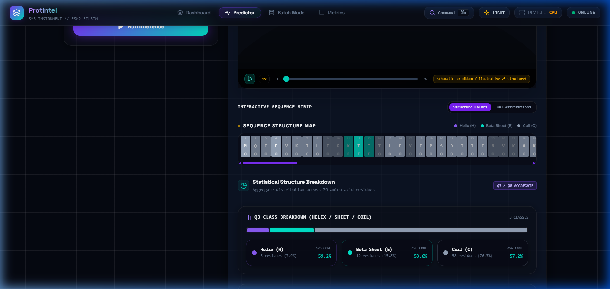
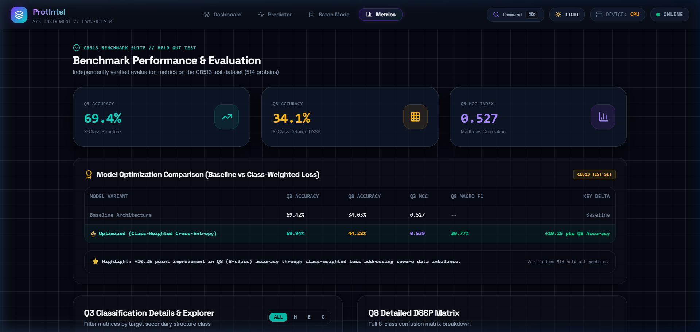

# ProtIntel 🧬

[](https://opensource.org/licenses/MIT)
[](https://www.python.org/)
[](https://pytorch.org/)
[](https://fastapi.tiangolo.com/)
[](https://react.dev/)
[](https://threejs.org/)

ProtIntel is a production-ready deep learning platform for explainable protein secondary structure prediction from amino acid sequences. It combines ESM-2 protein embeddings with a CNN–BiLSTM–Attention architecture and offers powerful residue-level interpretability through XAI methods.

Built for research, prototyping, and deployment, ProtIntel supports both single-sequence inference and batch FASTA processing, along with an interactive 3D visualization layer for scientific inspection.

---

## Why ProtIntel?

- Advanced protein representation: ESM-2 (650M) embeddings for rich per-residue contextual features
- Strong sequence modeling: multi-scale CNN + BiLSTM + multi-head attention
- Explainable AI: Integrated Gradients, SHAP, and attention-based reasoning
- Scientific workflow support: Q3 and Q8 prediction, benchmark evaluation, and batch analysis
- Modern product experience: FastAPI backend + React + Three.js frontend

---

## Key Features

- ESM-2 embeddings for high-quality residue representations
- Multi-scale CNN architecture with residual blocks for local motif learning
- Bidirectional LSTM for modeling long-range dependencies in amino acid chains
- Multi-head self-attention for interpretable sequence relationships
- Dual prediction heads:
  - Q3 classification: Helix, Strand, Coil
  - Q8 classification: DSSP 8-state output
- Explainability suite:
  - Integrated Gradients (IG)
  - SHAP values
  - Attention rollout / attention extraction
- Interactive web dashboard with 3D secondary structure visualization
- Batch prediction from FASTA files and summary export in JSON / CSV formats
- Benchmark evaluation support on standard protein datasets

---

## Architecture Overview

```text
Input Amino Acid Sequence (FASTA)
          ↓
   [ESM-2 650M Transformer Base]
   Per-residue embeddings: L × 1280
          ↓
 [Multi-Scale 1D CNN Block]
 Kernels: 3, 5, 7 + Residual Connections
          ↓
      [Bidirectional LSTM]
      2 Layers, Hidden Size = 256
          ↓
   [Multi-Head Self-Attention]
    8 Heads (interpretable weights)
          ↓
      ┌───────────────┴───────────────┐
      ↓                               ↓
 [Q3 Classifier Head]            [Q8 Classifier Head]
 3-state output                  8-state DSSP output
```

### Classification Targets

#### Q3 Classes

| Class | Name | Description |
|:---:|:---|:---|
| H | Helix | α-helical residues |
| E | Strand | β-sheet / extended residues |
| C | Coil | loop or irregular regions |

#### Q8 Classes

| State | Description |
|:---:|:---|
| H | α-Helix |
| E | β-Sheet |
| G | 3_10-Helix |
| I | π-Helix |
| B | β-Bridge |
| T | Turn |
| S | Bend |
| C | Coil |

---

## Platform Screenshots

### Dashboard


### 3D Structure Visualizer


### XAI Heatmap


### Statistical Breakdown



### Benchmark Evaluation



### Batch Processing


---

## System Requirements

| Component | Minimum | Recommended |
|:---|:---|:---|
| Python | 3.10 | 3.11+ |
| Node.js | 18+ | 20+ |
| GPU VRAM | 4 GB | 12+ GB |
| RAM | 8 GB | 16+ GB |
| Storage | 15 GB | 30 GB |
| CUDA | Optional | 11.8+ / 12.1+ |

---

## Quick Start

### 1. Clone the repository

```bash
git clone https://github.com/RamaVenkataCharan/ProtIntel.git
cd ProtIntel
```

### 2. Set up a Python virtual environment

```bash
python -m venv .venv

# macOS / Linux
source .venv/bin/activate

# Windows
.venv\Scripts\activate

pip install -r requirements.txt
```

### 3. Prepare data (optional for training)

```bash
python scripts/download_data.py
python scripts/preprocess.py
python scripts/generate_embeddings.py --device cuda
```

### 4. Run diagnostics

```bash
python preflight_checks.py
```

### 5. Start the backend

```bash
python backend/main.py
# API available at http://localhost:8000
```

### 6. Start the frontend

```bash
cd frontend
npm install
npm run dev
# UI available at http://localhost:5173
```

---

## REST API

| Method | Endpoint | Description |
|:---:|:---|:---|
| `POST` | `/predict` | Single-sequence prediction with optional XAI output |
| `POST` | `/predict_batch` | Batch prediction on multiple sequences |
| `POST` | `/upload` | Predict from uploaded FASTA file |
| `GET` | `/model_info` | Model metadata and runtime status |
| `GET` | `/metrics` | Benchmark statistics and evaluation metrics |
| `GET` | `/health` | Service health check |

### Example request

```bash
curl -X POST http://localhost:8000/predict \
  -H "Content-Type: application/json" \
  -d '{
    "sequence": "MQIFVKTLTGKTITLEVEPSDTIENVKAKIQDKEGIPPDQQRLIFAGKQLEDGRTLSDYNIQKESTLHLVLRLRGG",
    "return_xai": true,
    "xai_method": "ig"
  }'
```

---

## Explainable AI (XAI)

ProtIntel implements explainability methods to interpret model decisions at the residue level.

1. Integrated Gradients (IG)
   - Computes attribution by integrating gradients along a path from baseline to input
2. SHAP
   - Quantifies contribution of each residue using cooperative game theory
3. Attention-based analysis
   - Extracts attention weights and rollout patterns for interpretable sequence dependencies

These methods help highlight which amino acid positions are most influential for the predicted fold state.

---

## Repository Structure

```text
ProtIntel/
├── backend/                    # FastAPI backend and inference services
│   ├── main.py
│   ├── routes.py
│   ├── schemas.py
│   └── services/
├── frontend/                   # React + TypeScript + Three.js app
│   ├── src/
│   └── package.json
├── src/                        # Core deep learning modules
│   ├── models/
│   ├── training/
│   ├── evaluation/
│   └── xai/
├── docs/                       # Documentation and visual assets
│   └── images/
├── scripts/                    # Data download and preprocessing
├── preflight_checks.py         # Data and environment validation
├── train.py                    # Training entry point
├── infer.py                    # Single and batch inference CLI
├── evaluate.py                 # Evaluation pipeline
├── LICENSE                     # MIT license
├── requirements.txt            # Python dependencies
├── README.md                   # Project overview
└── .gitignore
```

---

## Evaluation & Benchmarking

The project includes evaluation workflows for validating model performance on protein secondary structure benchmarks such as CB513. Outputs include:

- confusion matrices
- per-class F1 score
- MCC metrics
- confidence histograms
- structural distribution summaries

---

## Authors

- M. Rama Venkata Charan
- B. Murali Gopi
- M. Kumar Siva Sai
- Yashwanth Prakash

Academic Advisor: Mrs. V. Aruna

Institution: Final Year B.Tech Computer Science Project

---

## Acknowledgments

- Meta AI Research — [ESM-2 Protein Language Models](https://github.com/facebookresearch/esm)
- Princeton ICML 2014 — [CullPDB / CB513 datasets](https://www.princeton.edu/~jzthree/datasets/ICML2014/)
- Three.js and React Three Fiber — interactive scientific visualization

---

## License

This project is open-source and licensed under the [MIT License](LICENSE).
