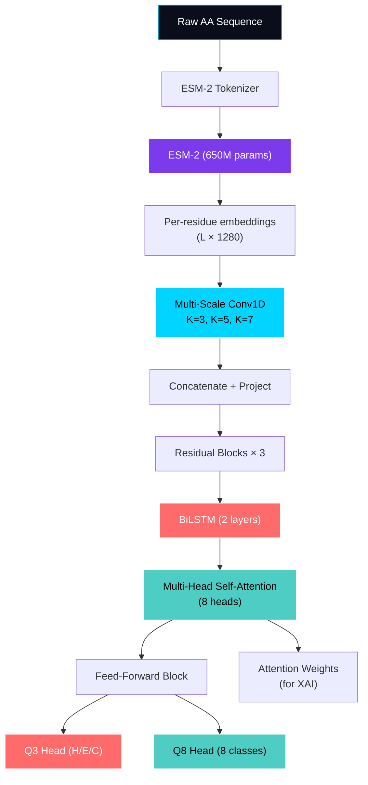

# ProtIntel Architecture

## Design Philosophy

ProtIntel uses a **hybrid architecture** that combines the strengths of four complementary paradigms:

1. **Pre-trained protein language model (ESM-2)** — Captures evolutionary and physicochemical context from training on 250M+ protein sequences
2. **Multi-scale CNN** — Detects local residue patterns at multiple spatial scales (3, 5, 7 residues)
3. **Bidirectional LSTM** — Captures long-range sequential dependencies across the full protein chain
4. **Self-attention** — Enables direct interaction between distant residues and produces interpretable attention weights

This combination addresses a key research gap: existing methods typically use only one or two of these paradigms.

## Architecture Diagram

## Component Details

### ESM-2 Embedding Generator
- **Model:** `facebook/esm2_t33_650M_UR50D` (33 transformer layers, 650M parameters)
- **Output:** Per-residue embeddings of dimension 1280
- **Mode:** Frozen by default; optionally fine-tune last N layers
- **Optimization:** Disk caching via SHA-256 sequence hashing

### Multi-Scale CNN Encoder
- **Parallel convolutions:** Kernel sizes 3, 5, 7 capture local patterns at different scales
- **Residual blocks:** 3 stacked blocks with BatchNorm and dropout
- **All convolutions use `padding='same'`** to preserve sequence length
- **Output dimension:** Configurable (default 512)

### Bidirectional LSTM
- **2 bidirectional layers:** Each direction has 256 hidden units → 512 total
- **Variable-length handling:** Uses `pack_padded_sequence` for efficient computation
- **Dropout:** Applied between layers

### Multi-Head Self-Attention
- **8 attention heads** with pre-LayerNorm formulation
- **Key feature:** Returns attention weights for explainability
- **Residual connection** for training stability

### Prediction Heads
- **Q3 Head:** Predicts Helix (H), Sheet (E), Coil (C)
- **Q8 Head:** Predicts H, E, G, I, B, T, S, C
- **Architecture:** Linear → ReLU → Dropout → Linear → Softmax
- **Returns:** Logits, probabilities, and confidence (max probability)

## Design Decisions

| Decision | Rationale |
|----------|-----------|
| ESM-2 over ProtBERT/ProtT5 | Higher downstream accuracy, efficient 650M size |
| Frozen ESM-2 by default | Reduces VRAM requirements; embeddings are already rich |
| Multi-scale CNN | Different kernel sizes capture different structural motifs |
| Pre-norm attention | More stable training than post-norm |
| Dual Q3/Q8 heads | Multi-task learning improves Q3 via Q8's finer labels |
| Label smoothing | Prevents overconfident predictions on ambiguous residues |
