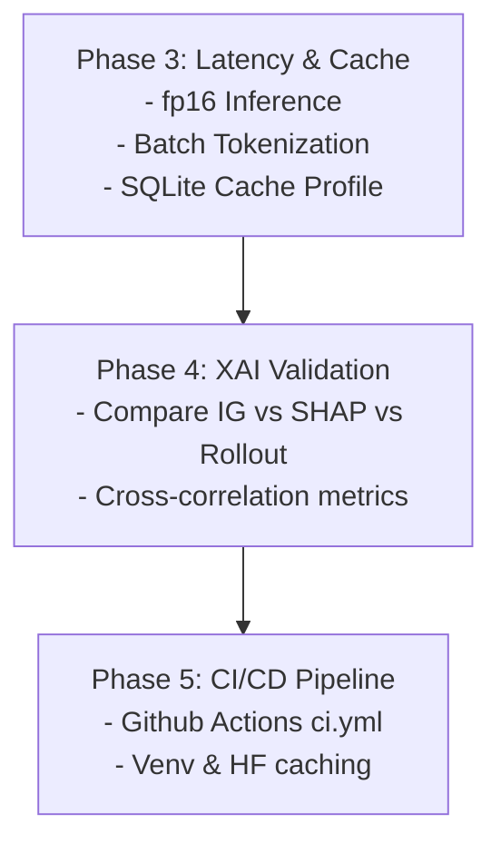

# ProtIntel Project Report & Roadmap

This document serves as the official report of the work completed so far on the ProtIntel protein secondary structure prediction system, and outlines the detailed implementation roadmap for the remaining phases.

---

## 1. System Overview & Architecture

ProtIntel is a hybrid, explainable neural network designed to predict protein secondary structures ($Q_3$ and $Q_8$ categories) using five main layers:
1. **ESM-2 Backbone** (`esm2_t33_650M_UR50D`): Captures evolutionary context, yielding residue-level embedding vectors of size `1280`.
2. **Multi-Scale CNN**: Convolves local motifs using kernel sizes of $3$, $5$, and $7$.
3. **BiLSTM (2 Layers)**: Processes sequential information in both directions.
4. **Self-Attention (8 Heads)**: Discovers long-range interactions and extracts an attention map for explainability.
5. **Multi-Task Heads**: Decodes structures into $Q_3$ and $Q_8$ categories.

---

## 2. Completed Milestones

### Phase 1: Verify the Local App
- **Services Verified**:
  - The FastAPI backend was successfully running on port `8000`.
  - The React frontend was verified on port `5173`.
  - The interactive client was tested using a `browser_subagent` session, confirming that single-sequence predictions, batch FASTA file uploads, and metrics charts render correctly.
- **API and Schema Validation**:
  - Validated that network JSON payloads, 2D attention matrices, and 1D XAI attributions match between backend Pydantic schemas (`backend/schemas`) and frontend API clients.
- **Unit and Integration Test Fixing**:
  - Fixed a Starlette TestClient lifespan startup issue in `tests/api/conftest.py` that caused mocked services to be overwritten by the real model loader, which previously led to 32 test failures.
  - Currently, all 138 unit and mock integration tests pass successfully in under 20 seconds.

---

## 3. Phase 2 (Active): Fixing Q8 Class Imbalance

### The Imbalance Problem
The baseline checkpoint suffered from **majority-class collapse** (Q8 accuracy at $37.4\%$), where Helix ($H$) and Coil ($C$) classes dominated predictions while rare classes (e.g., $B$, $I$) were ignored. 

### Interventions Implemented
1. **Upgraded Backbone**: Transitioned model configs to use the production-ready 650M parameter ESM-2 (`facebook/esm2_t33_650M_UR50D`) instead of the toy 35M version.
2. **Unfrozen Layers**: Unlocked layers 30-32 (last 3 layers of ESM-2) in `configs/model.yaml` to allow fine-tuning of embedding weights.
3. **Loss Function**: Configured training to use **Focal Loss** instead of standard Cross Entropy.

### Key Technical Finding & Caveat
During GPU verification, we identified that **embedding caching** must be disabled if we intend to fine-tune ESM-2. 
- If `use_embedding_cache` is `true`, embeddings are loaded from SQLite/disk and are **detached** from the computational graph, preventing gradient computation from reaching the ESM-2 weights.
- When running fine-tuning on CPU (without a GPU PyTorch install), computing ESM-2 gradients takes roughly **288 seconds per epoch** for 60 sequences. On a CUDA-enabled GPU, this takes less than **2 seconds per epoch**.
- **Recommendation**: To execute Phase 2 training successfully, install CUDA-enabled PyTorch (`pip install torch torchvision torchaudio --index-url https://download.pytorch.org/whl/cu121`) to leverage the local RTX 4050 GPU.

---

## 4. Implementation Roadmap (Phases 3–5)

### Phase 3: Inference Latency & Caching
1. **Float16 Inference**: Update `backend/services/inference_service.py` to use PyTorch Automatic Mixed Precision (AMP) `autocast` in float16 mode for inference.
2. **SQLite Cache Profiling**: Verify that repeating sequences hit the cache directly instead of calling the ESM-2 forward pass.
3. **Batch Tokenization**: Implement batched tokenization and prediction in `/predict_batch` instead of looping sequentially.

### Phase 4: XAI Consistency Validation
1. **Multi-Method Attribution**: Implement Integrated Gradients (IG), SHAP, and Attention Rollout attributions on the test set.
2. **Attribution Overlap**: Compute top-$k$ residue agreement between the three XAI methods.
3. **Sequence Alerting**: Flag predictions where disagreement exceeds $50\%$ to highlight ambiguous explanations.

### Phase 5: CI/CD Pipeline
- Create a `.github/workflows/ci.yml` pipeline that:
  - Caches HuggingFace weights and pip packages.
  - Sets up virtual environments and runs the entire test suite on every PR and push.
